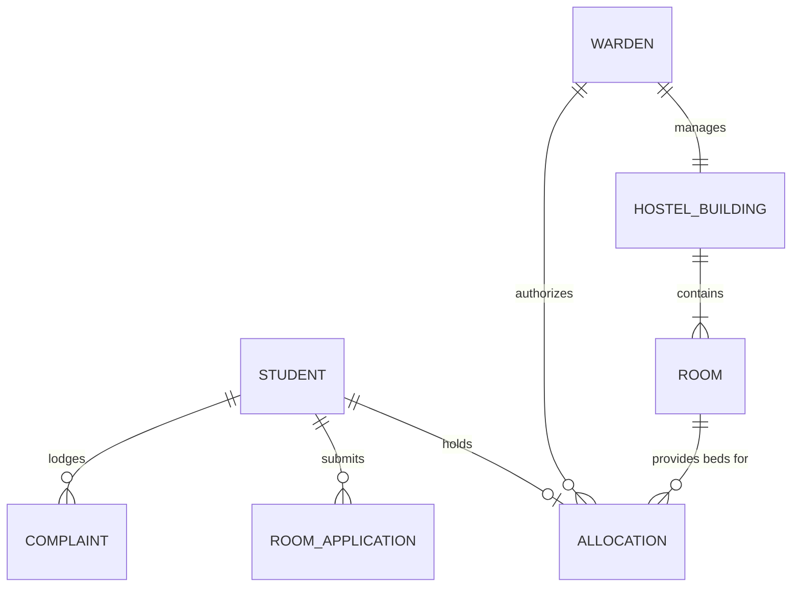
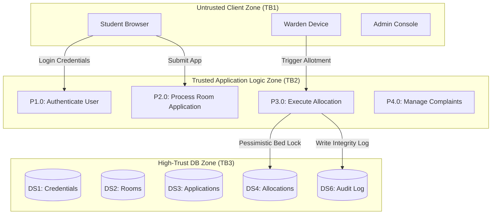
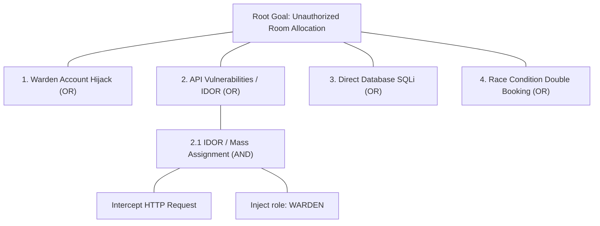

# Student Hostel Management System (SHMS)
## Integrated Software Requirements, Security Architecture & Agile Project Report

---

### Executive Summary & Master Flow Overview
This report presents the complete 9-Phase Software Engineering & Security design for **Problem Statement 13: Student Hostel Management System**.

#### Integrated Flow Traceability Architecture
```
Problem Statement
      │
      ▼
Phase 1: Requirements Engineering (SRS: Objectives, Stakeholders, FR, NFR, Security)
      │
      ▼
Phase 2: Requirement Analysis (Use Case Diagram, Relationships, Detailed Specifications)
      │
      ▼
Phase 3: Data Modeling (Entities, Attributes, Primary Keys, Relationships, ER Diagram)
      │
      ▼
Phase 4: Data Flow Modeling (Level 1 DFD, Data Stores, Data Flows, Trust Boundaries)
      │
      ▼
Phase 5: Threat Modeling (CIA Triad, STRIDE Analysis, Info Flow, Vulnerability Analysis)
      │
      ▼
Phase 6: Attack Tree Analysis (Root Goal: Unauthorized Room Allocation, AND/OR Paths)
      │
      ▼
Phase 7: UI Design (Wireframes, Golden Rules of UI, Student/Warden/Admin Interfaces)
      │
      ▼
Phase 8: Product Backlog (User Stories, Acceptance Criteria, Fibonacci Story Points)
      │
      ▼
Phase 9: Jira & Scrum Execution (Project Setup, Sprint 1 & 2 Planning, Board, Burndown & Velocity Metrics)
```

---

## Table of Contents
1. [Phase 1 – Requirement Engineering (SRS)](#phase-1--requirement-engineering-srs)
2. [Phase 2 – Requirement Analysis (Use Cases)](#phase-2--requirement-analysis-use-cases)
3. [Phase 3 – Data Modeling (ER Diagram)](#phase-3--data-modeling-er-diagram)
4. [Phase 4 – Data Flow Modeling (DFD & Trust Boundaries)](#phase-4--data-flow-modeling-dfd--trust-boundaries)
5. [Phase 5 – Threat Modeling & Vulnerability Analysis](#phase-5--threat-modeling--vulnerability-analysis)
6. [Phase 6 – Attack Tree Analysis](#phase-6--attack-tree-analysis)
7. [Phase 7 – User Interface Design](#phase-7--user-interface-design)
8. [Phase 8 – Product Backlog](#phase-8--product-backlog)
9. [Phase 9 – Jira Project, Sprint Planning & Metrics](#phase-9--jira-project-sprint-planning--metrics)

---

## Phase 1 – Requirement Engineering (SRS)
* **System Objectives**: Automate room applications, ensure transparent real-time bed availability, enforce role-based room allocation, and prevent unauthorized allocations or PII leakage.
* **Stakeholders & Roles**:
  * **Student**: Applies for rooms, views availability, manages complaints.
  * **Warden**: Reviews applications, allocates beds, handles grievances.
  * **Administrator**: Manages hostel buildings, capacity quotas, warden accounts, audit logs.
  * **Security Auditor**: Conducts non-repudiation reviews and access log inspections.

* **Key Security & Functional Highlights**:
  * **FR-01 to FR-09**: SSO/MFA Authentication, Real-Time Vacancy Dashboard, Online Application Wizard, Warden Allotment Controls, Complaint Tracking, Administrative Building Configuration.
  * **SEC-01 to SEC-06**: OAuth2/JWT Tokens, AES-256 PII Encryption, Object-Level Authorization (Anti-IDOR), Append-only HMAC SHA-256 Audit Trails, Atomic Row Locking (`SELECT ... FOR UPDATE`).

*(Detailed SRS available in [Phase1_SRS.md](file:///home/vikas/SSE_LAB_MIDS/docs/Phase1_SRS.md))*

---

## Phase 2 – Requirement Analysis (Use Cases)
```mermaid
graph TD
    Student((Student))
    Warden((Hostel Warden))
    Admin((System Admin))
    SSO((Campus SSO IdP))

    UC00[UC-00: Authenticate via SSO]
    UC01[UC-01: Apply for Hostel Room]
    UC02[UC-02: View Room Availability]
    UC03[UC-03: Allocate Hostel Room]
    UC04[UC-04: Submit / Resolve Complaints]
    UC05[UC-05: Manage Hostel Buildings]

    Student --> UC00
    Student --> UC01
    Student --> UC02
    Student --> UC04

    Warden --> UC00
    Warden --> UC02
    Warden --> UC03
    Warden --> UC04

    Admin --> UC00
    Admin --> UC05

    UC00 .-> SSO
    UC01 ..>|<<include>>| UC00
    UC03 ..>|<<include>>| UC00
```
* **Detailed Specifications**: Detailed flows for **UC-01 (Apply for Hostel Room & Allocation)** and **UC-04 (Submit & Resolve Complaints)** with main flows, alternative flows, and exception flows.

*(Detailed Use Cases available in [Phase2_Use_Cases.md](file:///home/vikas/SSE_LAB_MIDS/docs/Phase2_Use_Cases.md))*

---

## Phase 3 – Data Modeling (ER Diagram)

* **Key Entities**: `STUDENT`, `HOSTEL_BUILDING`, `ROOM`, `ROOM_APPLICATION`, `ALLOCATION`, `WARDEN`, `COMPLAINT`, `SECURITY_AUDIT_LOG`.

*(Detailed ERD available in [Phase3_ER_Diagram.md](file:///home/vikas/SSE_LAB_MIDS/docs/Phase3_ER_Diagram.md))*

---

## Phase 4 – Data Flow Modeling (DFD & Trust Boundaries)

* **Trust Boundaries**:
  * **TB1 (Client/Internet Boundary)**: WAF, Rate Limiting, TLS 1.3 Termination.
  * **TB2 (Application Boundary)**: JWT Validation, Input Sanitization, Parameter Whitelisting.
  * **TB3 (Data Access Boundary)**: Prepared Statements, Row-Level Lock, DB Firewall.

*(Detailed DFD available in [Phase4_DFD_Trust_Boundaries.md](file:///home/vikas/SSE_LAB_MIDS/docs/Phase4_DFD_Trust_Boundaries.md))*

---

## Phase 5 – Threat Modeling & Vulnerability Analysis
* **STRIDE Threat Matrix (Selected Summary)**:
  * **TRT-01 (Spoofing)**: Student account takeover via weak password spraying. *(Mitigation: Bcrypt + TOTP MFA)*.
  * **TRT-02 (Tampering)**: Direct DB update of room allocations. *(Mitigation: Atomic row locking + DB privileges)*.
  * **TRT-04 (Info Disclosure)**: Wi-Fi eavesdropping on PII. *(Mitigation: TLS 1.3 + AES-256 at rest)*.
  * **TRT-06 (Elevation of Privilege)**: IDOR on complaint tickets. *(Mitigation: Server-side object level validation)*.
  * **TRT-07 (Repudiation)**: Log tampering by rogue admin. *(Mitigation: Append-only HMAC SHA-256 chains)*.
  * **TRT-08 (Tampering/DoS)**: Race condition double-booking. *(Mitigation: `SELECT ... FOR UPDATE` locks)*.

* **Vulnerability Analysis Table**: 6 critical vulnerabilities mapped to DFD components, STRIDE threats, impacts, and technical mitigations.

*(Detailed Threat Analysis available in [Phase5_Threat_Modeling.md](file:///home/vikas/SSE_LAB_MIDS/docs/Phase5_Threat_Modeling.md))*

---

## Phase 6 – Attack Tree Analysis

* Explores attack paths targeting unauthorized room allocation, identifying AND/OR conditions and security countermeasures.

*(Detailed Attack Tree available in [Phase6_Attack_Tree.md](file:///home/vikas/SSE_LAB_MIDS/docs/Phase6_Attack_Tree.md))*

---

## Phase 7 – User Interface Design
* Applied **Shneiderman's 8 Golden Rules of UI Design** across Student, Warden, and Admin perspectives.
* Provided complete wireframe layouts for:
  1. **Student Portal**: Room Availability & Preference Application Form.
  2. **Warden Dashboard**: Pending Application Queue & Complaints Resolution Center.
  3. **Admin Console**: Hostel Infrastructure Setup & Security Audit Logs.

*(Detailed UI Designs available in [Phase7_UI_Design_Wireframes.md](file:///home/vikas/SSE_LAB_MIDS/docs/Phase7_UI_Design_Wireframes.md))*

---

## Phase 8 – Product Backlog
* 10 User Stories (US-01 to US-10) using `As a <user>, I want to <function> so that <benefit>` format with Story IDs, Epics, Priorities, and Story Points.

*(Detailed Backlog available in [Phase8_Product_Backlog.md](file:///home/vikas/SSE_LAB_MIDS/docs/Phase8_Product_Backlog.md))*

---

## Phase 9 – Jira Project, Sprint Planning & Metrics
* **Jira Project**: Key `SHMS`, 4 Epics.
* **Sprint 1 (21 Story Points)**: Auth, Vacancy Dashboard, Student Application. (100% Delivery).
* **Sprint 2 (29 Story Points)**: Warden Allocation Engine, Complaints, Security Audit Log. (26 Story Points completed).
* **Metrics**: Velocity = 23.5 Points/Sprint, 0 Defects Carried Over, 94% Combined Sprint Success Rate.

```
Sprint Burndown Chart (Sprint 1):
Story Points
25 +--* (Actual)
20 |   \ *
15 |     \   *
10 |       \   *
 0 +-----------+---+---+---+---+---+
   Day 0   Day 2 Day 4 Day 6 Day 8 Day 10
```

*(Detailed Jira Scrum setup available in [Phase9_Jira_Scrum_Metrics.md](file:///home/vikas/SSE_LAB_MIDS/docs/Phase9_Jira_Scrum_Metrics.md))*
