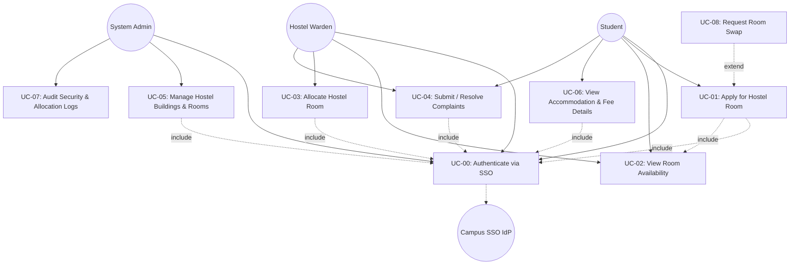

# Phase 2: Requirement Analysis

## Exercise 2: Develop Use Cases & UML Use Case Diagram

### 1. Actor Identification
1. **Student**: Regular campus student seeking or managing hostel accommodation.
2. **Warden**: Hostel block supervisor responsible for processing allocations and handling complaints.
3. **Administrator (Admin)**: System administrator responsible for infrastructure, configuration, and security audits.
4. **Authentication System (External)**: Campus SSO / Identity Provider (IdP) service.

---

### 2. Major Use Cases & Relationships

| Use Case ID | Use Case Title | Primary Actor | Included Use Cases (`<<include>>`) | Extended Use Cases (`<<extend>>`) |
| :--- | :--- | :--- | :--- | :--- |
| **UC-01** | Apply for Hostel Room | Student | Login (UC-00), Check Room Availability | Request Roommate Swap (`<<extend>>`) |
| **UC-02** | View Room Availability | Student, Warden | Login (UC-00) | Filter by Amenities / Block |
| **UC-03** | Allocate Hostel Room | Warden | Login (UC-00), Verify Student Details | Manual Allocation Override (`<<extend>>`) |
| **UC-04** | Manage Student Complaints | Student, Warden | Login (UC-00) | Escalate to Admin (`<<extend>>`) |
| **UC-05** | Manage Hostel Information | Admin | Login (UC-00) | Bulk Capacity Import (`<<extend>>`) |
| **UC-06** | View Accommodation Details | Student | Login (UC-00) | Download Allotment Letter (`<<extend>>`) |
| **UC-07** | Review Security Audit Logs | Admin | Login (UC-00) | Export Audit Log PDF (`<<extend>>`) |

---

### 3. UML Use Case Diagram (Mermaid Syntax)

---

## Exercise 3: Detailed Use Case Specifications

### Use Case Specification 1: UC-01 - Apply for Hostel Room & Allocation

| Section | Description |
| :--- | :--- |
| **Use Case ID & Name** | **UC-01: Apply for Hostel Room & Allocation** |
| **Primary Actor** | Student |
| **Secondary Actor(s)** | Warden, System Database, Notification Service |
| **Description** | Student selects hostel preferences, submits an application for a hostel room, and the system/warden processes allocation based on availability and merit. |
| **Preconditions** | 1. Student must be registered in the university database. 2. Student must be authenticated via SSO. 3. Room application window must be active. |
| **Postconditions** | 1. Application record is stored with status `PENDING` or `ALLOCATED`. 2. Room bed count is reserved atomically. 3. Notification email is dispatched to the student and warden. |
| **Main Success Flow (Basic Flow)** | 1. Student navigates to the Hostel Application portal. 2. System displays available Hostel Blocks, Room Types, and live vacant bed counts. 3. Student selects preferred block, room type, and submits student credentials/academic details. 4. System validates eligibility (no outstanding dues, valid active student status). 5. System generates a unique Application Reference ID and sets status to `PENDING`. 6. Warden reviews application in Warden Portal. 7. Warden clicks `Approve & Allocate Room`. 8. System assigns Block, Room, and Bed ID, locks the bed record, and updates status to `ALLOCATED`. 9. System sends SMS/Email notification with Allotment Summary to the student. |
| **Alternative Flow(s)** | **ALT-1: Preferred Room Full**: If student's top preference is full, system highlights available alternate blocks and permits student to update selection before submission. **ALT-2: Automated Auto-Allocation**: If auto-allocation rule is enabled by Admin, system immediately processes merit rank and allocates room without manual Warden click. |
| **Exception Flow(s)** | **EX-1: Double Allocation Race Condition**: If two students select the last vacant bed simultaneously, database row lock enforces atomic check; second transaction fails with error *"Room bed no longer available, please refresh."* **EX-2: Disciplinary Hold**: If university database flags student with a disciplinary hold, application is blocked with message *"Application denied due to active administrative hold."* |

---

### Use Case Specification 2: UC-04 - Submit and Resolve Maintenance Complaints

| Section | Description |
| :--- | :--- |
| **Use Case ID & Name** | **UC-04: Submit and Resolve Maintenance Complaints** |
| **Primary Actor** | Student |
| **Secondary Actor(s)** | Warden, Maintenance Staff |
| **Description** | Allocated student submits a facility grievance (plumbing, electrical, furniture), warden reviews and assigns maintenance staff, and updates complaint status to resolution. |
| **Preconditions** | 1. Student must have an active allocated room. 2. Student must be authenticated. |
| **Postconditions** | 1. Complaint ticket is logged in `ComplaintStore`. 2. Maintenance job assigned to staff. 3. Ticket status updated to `RESOLVED` with resolution timestamp. |
| **Main Success Flow (Basic Flow)** | 1. Student accesses Complaint Portal and clicks `Lodge New Complaint`. 2. Student selects category (Electrical / Plumbing / Furniture / Security), enters description, room number, and optional photo evidence. 3. System registers ticket ID, sets status to `SUBMITTED`, and notifies Block Warden. 4. Warden opens Warden Complaints Dashboard, views pending tickets. 5. Warden assigns maintenance staff and updates status to `IN_PROGRESS`. 6. Maintenance staff rectifies physical issue. 7. Warden marks ticket as `RESOLVED` with remarks. 8. System requests student satisfaction feedback rating. |
| **Alternative Flow(s)** | **ALT-1: Student Re-opens Ticket**: If issue is unresolved, student clicks `Re-open Ticket` within 48 hours, reverting status to `REOPENED` with escalation flag. |
| **Exception Flow(s)** | **EX-1: Invalid Room Details**: If student attempts to submit complaint for a room not assigned to them, system rejects submission with IDOR error. |
