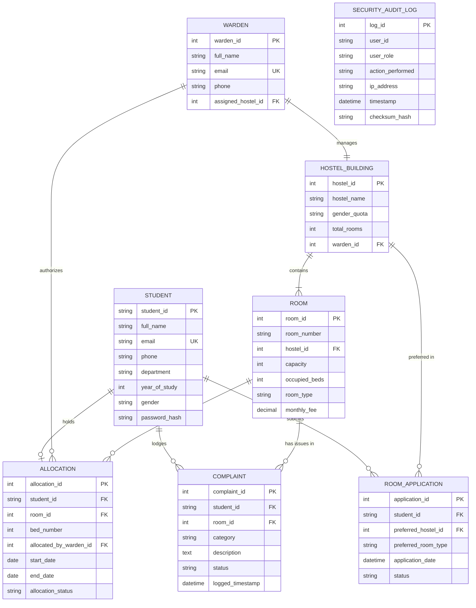

# Phase 3: Data Modeling

## Exercise 4: Develop Entity-Relationship (ER) Diagram

---

### 1. Entity Identification & Attribute Definitions

#### Entity 1: `STUDENT`
* `student_id` (PK, VARCHAR(20)): Unique student registration number.
* `full_name` (VARCHAR(100)): Student's full legal name.
* `email` (VARCHAR(100), UNIQUE): Institutional email address.
* `phone` (VARCHAR(15)): Contact phone number.
* `department` (VARCHAR(50)): Academic department.
* `year_of_study` (INT): Current academic year (1-4).
* `gender` (VARCHAR(10)): Student gender for room allocation quota matching.
* `password_hash` (VARCHAR(255)): Bcrypt salted password hash.
* `mfa_secret` (VARCHAR(100)): Multi-Factor Authentication secret key.

#### Entity 2: `HOSTEL_BUILDING`
* `hostel_id` (PK, INT): Unique identifier for hostel building.
* `hostel_name` (VARCHAR(100)): Building name (e.g., Block A, Sunflower Hall).
* `gender_quota` (VARCHAR(10)): Designated gender (Male / Female / Co-ed).
* `total_rooms` (INT): Total room capacity.
* `warden_id` (FK, INT): Assigned warden reference ID.

#### Entity 3: `ROOM`
* `room_id` (PK, INT): Unique internal room identifier.
* `room_number` (VARCHAR(10)): Physical room number (e.g., A-301).
* `hostel_id` (FK, INT): Parent hostel building reference ID.
* `capacity` (INT): Total bed capacity (1, 2, 3).
* `occupied_beds` (INT): Current number of occupied beds.
* `room_type` (VARCHAR(20)): Single / Double / AC / Non-AC.
* `monthly_fee` (DECIMAL(10,2)): Room fee tariff.

#### Entity 4: `ROOM_APPLICATION`
* `application_id` (PK, INT): Unique application reference number.
* `student_id` (FK, VARCHAR(20)): Applicant student reference.
* `preferred_hostel_id` (FK, INT): Top preference hostel building.
* `preferred_room_type` (VARCHAR(20)): Preferred room configuration.
* `application_date` (DATETIME): Date and time of application submission.
* `status` (VARCHAR(20)): Status (`PENDING`, `APPROVED`, `REJECTED`, `CANCELLED`).
* `remarks` (TEXT): Warden notes or student justification.

#### Entity 5: `ALLOCATION`
* `allocation_id` (PK, INT): Unique room allocation record ID.
* `student_id` (FK, VARCHAR(20)): Allocated student ID.
* `room_id` (FK, INT): Allocated room ID.
* `bed_number` (INT): Assigned bed position (1, 2, 3).
* `allocated_by_warden_id` (FK, INT): Warden who approved allocation.
* `start_date` (DATE): Term occupancy start date.
* `end_date` (DATE): Term occupancy end date.
* `allocation_status` (VARCHAR(20)): Status (`ACTIVE`, `VACATED`, `REVOKED`).

#### Entity 6: `WARDEN`
* `warden_id` (PK, INT): Unique warden employee ID.
* `full_name` (VARCHAR(100)): Warden full name.
* `email` (VARCHAR(100), UNIQUE): Official email address.
* `phone` (VARCHAR(15)): Warden emergency contact number.
* `assigned_hostel_id` (FK, INT): Primary assigned hostel building.

#### Entity 7: `COMPLAINT`
* `complaint_id` (PK, INT): Unique ticket ID.
* `student_id` (FK, VARCHAR(20)): Submitting student reference ID.
* `room_id` (FK, INT): Affected room ID.
* `category` (VARCHAR(30)): Electrical, Plumbing, Structural, Hygiene, Security.
* `description` (TEXT): Detail of grievance.
* `status` (VARCHAR(20)): `OPEN`, `IN_PROGRESS`, `RESOLVED`, `CLOSED`.
* `logged_timestamp` (DATETIME): Creation timestamp.
* `resolved_timestamp` (DATETIME): Resolution timestamp.

#### Entity 8: `SECURITY_AUDIT_LOG`
* `log_id` (PK, INT): Unique audit log index.
* `user_id` (VARCHAR(50)): Performing user identifier.
* `user_role` (VARCHAR(20)): Student / Warden / Admin.
* `action_performed` (VARCHAR(100)): Action description (e.g., `ROOM_ALLOCATION_OVERRIDE`).
* `ip_address` (VARCHAR(45)): Client IP address.
* `timestamp` (DATETIME): System timestamp.
* `checksum_hash` (VARCHAR(64)): HMAC-SHA256 hash for log integrity verification.

---

### 2. Relationships & Cardinalities

1. **STUDENT to ROOM_APPLICATION**: One-to-Many (`1 : N`) – A student can submit multiple applications over different semesters, but each application belongs to exactly one student.
2. **STUDENT to ALLOCATION**: One-to-One active (`1 : 1`) – A student can hold at most one active room allocation at any point in time.
3. **HOSTEL_BUILDING to ROOM**: One-to-Many (`1 : N`) – A hostel building contains many rooms; each room belongs to exactly one hostel building.
4. **ROOM to ALLOCATION**: One-to-Many (`1 : N`) – A room has multiple bed allocations up to its capacity limit.
5. **WARDEN to HOSTEL_BUILDING**: One-to-One (`1 : 1`) – Each warden supervises one primary hostel building.
6. **WARDEN to ALLOCATION**: One-to-Many (`1 : N`) – A warden approves and logs multiple room allocations.
7. **STUDENT to COMPLAINT**: One-to-Many (`1 : N`) – A student can lodge multiple maintenance complaints.
8. **ROOM to COMPLAINT**: One-to-Many (`1 : N`) – A room can be associated with multiple maintenance complaint tickets.

---

### 3. Mermaid Entity-Relationship Diagram (ERD)

