# Phase 4: Data Flow Modeling

## Exercise 5: Data Flow Diagram (DFD) with Trust Boundaries

---

### 1. DFD Components Breakdown

#### External Entities
1. **Student**: Submits applications, views availability, manages accommodation, submits complaints.
2. **Hostel Warden**: Reviews applications, allocates rooms, updates complaint resolution status.
3. **Administrator**: Configures hostels, manages warden accounts, views audit logs.
4. **Campus SSO / Identity Provider**: External authentication service.

#### Core Processes (Level 1)
* **P1.0: Authenticate & Authorize User**: Validates user credentials and issues session JWT tokens.
* **P2.0: Process Room Application**: Validates student eligibility, checks availability, and registers application.
* **P3.0: Allocate Room & Manage Quotas**: Evaluates pending applications, verifies bed capacity, executes atomic bed lock, and updates allocation registry.
* **P4.0: Manage Complaints & Grievances**: Receives student complaints, routes to warden, updates ticket resolution.
* **P5.0: Manage Hostel Infrastructure & System Audit**: Admin operations to configure buildings, rooms, wardens, and generate tamper-evident audit logs.

#### Data Stores
* **DS1: Student DB (`STUDENT`, `USER_CREDENTIALS`)**
* **DS2: Room & Hostel DB (`HOSTEL_BUILDING`, `ROOM`)**
* **DS3: Application DB (`ROOM_APPLICATION`)**
* **DS4: Allocation DB (`ALLOCATION`)**
* **DS5: Complaint DB (`COMPLAINT`)**
* **DS6: Audit Log DB (`SECURITY_AUDIT_LOG`)**

---

### 2. Trust Boundaries Identified

To ensure robust security architecture, four explicit **Trust Boundaries (TB)** are defined:

* **Trust Boundary 1 (TB1: User / Internet Boundary)**: Separates untrusted web clients (Student browser, Warden device) from the Application Gateway / Web Server. All incoming traffic must pass through HTTPS TLS 1.3 termination, Web Application Firewall (WAF), and Rate Limiting filters.
* **Trust Boundary 2 (TB2: Application Logic Boundary)**: Separates the public HTTP API controllers from core internal processing services (Allocation Engine, Complaint Engine). Enforces JWT RBAC token validation and input sanitization.
* **Trust Boundary 3 (TB3: Data Access Boundary)**: Separates business logic microservices from backend database storage engines (`DS1` through `DS6`). Enforces database user privilege restrictions, prepared statements, and connection pooling.
* **Trust Boundary 4 (TB4: External Identity Provider Boundary)**: Separates university SSO server from internal SHMS authentication service.

---

### 3. Level 1 Data Flow Diagram (Mermaid Diagram with Trust Boundaries)

```mermaid
flowchart TB
    %% Subgraph Trust Boundaries
    subgraph Client_Zone ["Untrusted Client Zone (TB1 Boundary Outer)"]
        EE_Student["External Entity: Student"]
        EE_Warden["External Entity: Warden"]
        EE_Admin["External Entity: Admin"]
    end

    subgraph App_Zone ["Trusted Application Logic Zone (Inside TB2 & TB3)"]
        P1["P1.0: Authenticate User & Issue Token"]
        P2["P2.0: Process Room Application"]
        P3["P3.0: Execute Room Allocation"]
        P4["P4.0: Manage Complaints"]
        P5["P5.0: Configure Infrastructure & Audit"]
    end

    subgraph Data_Zone ["High Trust Database Zone (Protected by TB3)"]
        DS1[("DS1: Student & Credential Store")]
        DS2[("DS2: Hostel & Room Store")]
        DS3[("DS3: Room Application Store")]
        DS4[("DS4: Allocation Store")]
        DS5[("DS5: Complaint Store")]
        DS6[("DS6: Security Audit Log Store")]
    end

    subgraph External_Zone ["External Identity Zone (TB4 Boundary)"]
        EE_SSO["External Entity: Campus SSO IdP"]
    end

    %% Data Flows Across TB1
    EE_Student -- "1. Login Credentials" --> P1
    EE_Warden -- "1. Login Credentials" --> P1
    EE_Admin -- "1. Login Credentials" --> P1

    EE_Student -- "2. Submit Room App Form" --> P2
    P2 -- "3. Display Vacant Rooms" --> EE_Student

    EE_Warden -- "4. Trigger Room Allocation" --> P3
    P3 -- "5. Allocation Confirmation" --> EE_Warden

    EE_Student -- "6. Submit Complaint Ticket" --> P4
    EE_Warden -- "7. Update Ticket Resolution" --> P4

    EE_Admin -- "8. Update Hostel Configuration" --> P5
    P5 -- "9. System & Audit Reports" --> EE_Admin

    %% External SSO Flow across TB4
    P1 <-->|SSO Validation Token| EE_SSO

    %% Data Flows to Stores (TB3 Boundary Interactions)
    P1 -->|Read Credentials| DS1
    P2 -->|Query Capacity| DS2
    P2 -->|Save Application| DS3
    P3 -->|Read Pending Apps| DS3
    P3 -->|Atomic Bed Lock & Save| DS4
    P3 -->|Update Occupied Bed Count| DS2
    P4 -->|Create / Update Ticket| DS5
    P5 -->|Update Hostels & Rooms| DS2
    
    %% Audit Logging Flows (Security Requirement)
    P1 -->|Log Auth Action| DS6
    P3 -->|Log Allocation Override| DS6
    P5 -->|Log Admin Action| DS6
```

---

### 4. DFD Consistency Verification Matrix

| DFD Element | Related Use Case | Related ERD Entity | Security Control / Trust Boundary |
| :--- | :--- | :--- | :--- |
| **P1.0 Auth Process** | UC-00 Authenticate | `STUDENT`, `WARDEN` | TB1 / TB4 - TLS 1.3, MFA, OAuth2 JWT token signature check |
| **P2.0 App Process** | UC-01 Apply Room | `ROOM_APPLICATION` | TB2 - Input sanitization, CORS, Rate limiting |
| **P3.0 Allocation** | UC-03 Allocate Room | `ALLOCATION`, `ROOM` | TB2 / TB3 - Database row locks, atomic transactions, RBAC |
| **P4.0 Complaints** | UC-04 Complaints | `COMPLAINT` | TB2 - Object Level Authorization check (IDOR mitigation) |
| **P5.0 Admin & Audit** | UC-05, UC-07 | `HOSTEL`, `AUDIT_LOG` | TB3 - Append-only HMAC SHA-256 integrity protection |
