# Phase 6: Attack Tree Analysis

## Exercise 10: Develop an Attack Tree

---

### 1. Attacker Goal & Context
* **Root Attacker Goal**: **"Achieve Unauthorized Room Allocation / Modify Hostel Accommodation Records"**
* **Attacker Motivation**: Secure a premium single/AC hostel room without meeting merit criteria, bypass payment fees, or allocate rooms to unauthorized non-students.
* **Target System**: Student Hostel Management System (SHMS) Application Logic, Database, and Warden Session Management.

---

### 2. Attack Tree Diagram (Mermaid Syntax)

```mermaid
graph TD
    %% Root Goal
    ROOT["Root Goal: Unauthorized Room Allocation / Record Modification"]

    %% Primary Attack Paths (OR Conditions)
    PATH1["1. Compromise Warden Account Privileges (OR)"]
    PATH2["2. Exploit Application API Vulnerabilities (OR)"]
    PATH3["3. Direct Database Manipulation (OR)"]
    PATH4["4. Exploit Concurrency / Race Conditions (OR)"]

    ROOT --- PATH1
    ROOT --- PATH2
    ROOT --- PATH3
    ROOT --- PATH4

    %% Sub-nodes under PATH1 (Warden Compromise)
    P1_1["1.1 Phishing / Social Engineering Warden Credentials (OR)"]
    P1_2["1.2 Session Hijacking via Stolen JWT Token (AND)"]
    P1_3["1.3 Credential Stuffing / Brute Force (OR)"]

    PATH1 --- P1_1
    PATH1 --- P1_2
    PATH1 --- P1_3

    P1_2_A["1.2.1 Sniff Unencrypted Network Traffic"]
    P1_2_B["1.2.2 Inject XSS Script to Steal Token"]
    P1_2 --- P1_2_A
    P1_2 --- P1_2_B

    %% Sub-nodes under PATH2 (API Exploitation)
    P2_1["2.1 Insecure Direct Object Reference - IDOR (OR)"]
    P2_2["2.2 Privilege Escalation via Mass Assignment (AND)"]
    P2_3["2.3 Broken Parameter Validation / BAC (OR)"]

    PATH2 --- P2_1
    PATH2 --- P2_2
    PATH2 --- P2_3

    P2_2_A["2.2.1 Intercept Student Allocation HTTP Payload"]
    P2_2_B["2.2.2 Add admin_override: true Parameter"]
    P2_2 --- P2_2_A
    P2_2 --- P2_2_B

    %% Sub-nodes under PATH3 (Database Manipulation)
    P3_1["3.1 SQL Injection on Room Selection Endpoint (AND)"]
    P3_2["3.2 Rogue Internal DBA Access (OR)"]

    PATH3 --- P3_1
    PATH3 --- P3_2

    P3_1_A["3.1.1 Inject Arbitrary UPDATE SQL Payload"]
    P3_1_B["3.1.2 Bypass Input Sanitization Filter"]
    P3_1 --- P3_1_A
    P3_1 --- P3_1_B

    %% Sub-nodes under PATH4 (Race Condition)
    P4_1["4.1 Double Booking Exploit via Parallel Requests (AND)"]
    PATH4 --- P4_1

    P4_1_A["4.1.1 Send 50 Concurrent HTTP Allocation Requests"]
    P4_1_B["4.1.2 Exploit Missing Database Row Lock"]
    P4_1 --- P4_1_A
    P4_1 --- P4_1_B
```

---

### 3. Detailed Attack Path Analysis & Countermeasures

#### Attack Path 1: Credential & Session Hijacking of Warden (Path 1.2 - AND Condition)
* **Description**: Attacker targets Warden account using Cross-Site Scripting (XSS) to exfiltrate session JWT tokens.
* **AND Condition Required**: Attacker must (1) Find an un-sanitized input field in complaint description to execute XSS **AND** (2) Extract stored token from `localStorage` because `HttpOnly` flag was missing.
* **Mitigation**:
  * Store JWT tokens exclusively in `HttpOnly`, `Secure`, `SameSite=Strict` cookies.
  * Enable strict Content Security Policy (CSP) blocking inline scripts.

#### Attack Path 2: Privilege Escalation via Mass Assignment / IDOR (Path 2.2 - AND Condition)
* **Description**: A student user tampers with the JSON payload during application submission.
* **AND Condition Required**: Attacker must (1) Intercept HTTP POST request using proxy tool (Burp Suite) **AND** (2) Inject `{"role": "WARDEN", "allocation_status": "APPROVED"}` where backend fails to whitelist allowed DTO parameters.
* **Mitigation**:
  * Strict DTO parameter binding (explicitly ignoring unknown fields).
  * Server-side authorization check enforcing `token.role == WARDEN`.

#### Attack Path 3: Direct Database SQL Injection (Path 3.1 - AND Condition)
* **Description**: Attacker manipulates input parameters to execute raw SQL against `ALLOCATION` data store.
* **AND Condition Required**: Attacker must (1) Locate string concatenation query in application code **AND** (2) Crafts SQL payload (`' OR '1'='1'; UPDATE ALLOCATION SET student_id='ATTACKER' WHERE room_id=101;--`).
* **Mitigation**:
  * Mandatory use of Prepared Statements / Parameterized Queries across all database access layers.

#### Attack Path 4: Concurrency Race Condition (Path 4.1 - AND Condition)
* **Description**: Attacker uses automated script to send simultaneous requests to occupy a single vacant bed.
* **AND Condition Required**: Attacker must (1) Identify a popular vacant room **AND** (2) Dispatch 50 parallel POST requests within 5 milliseconds while database lacks pessimistic locking (`FOR UPDATE`).
* **Mitigation**:
  * Execute room bed allocation inside serializable transactions using `SELECT ... FOR UPDATE` row locks.
